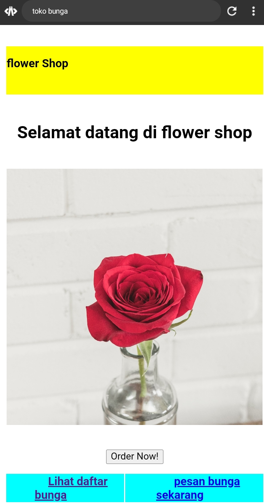
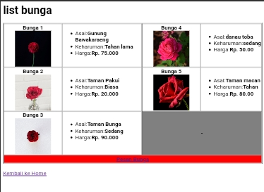
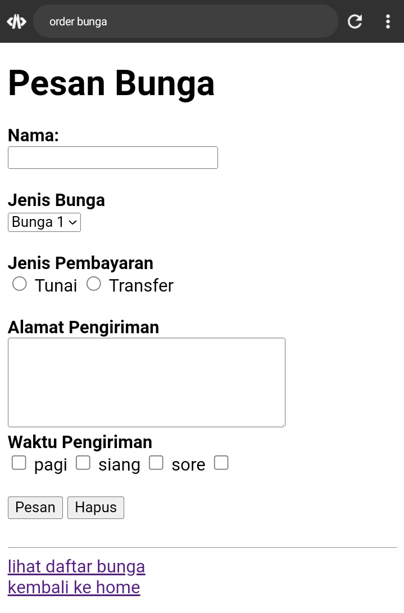

# Index Bunga
## Program

```html
<!DOCTYPE html>
<html>
<head>
    <title>toko bunga</title>
</head>
<body>
    <table height="100%" width="100%">
        <tr>
            <th colspan="2" style="background-color: yellow;" align="left"> <p>flower Shop</p>
        </th>
        </tr>
        <tr>
            <th colspan="2">
                <h2 align="center">Selamat datang di flower shop</h2>
                
            </th>
        </tr>
        <tr>
            <th colspan="2" align="center" height="50">
              <input type="submit" value="Order Now!">
            </th>
        </tr>
        <tr style="background-color: aqua;">
         <th>
         <a href="list_bunga.html">Lihat daftar bunga</a>
         </th>
         <th>
         <a href="orderan_bunga.html">pesan bunga sekarang</a>
         </th>
        </tr>
    </table>
</body>
</html>
```

## Hasil



## Analisis

1. `<!DOCTYPE html>`: Mendefinisikan jenis dokumen HTML yang digunakan, dalam hal ini HTML5.

2. `<html>`: Mulai dari elemen root dari halaman HTML.

3. `<head>`: Elemen yang berisi informasi meta-data tentang halaman, seperti judul, pautan ke stylesheet, dll.
4. `<title>`: Mendefinisikan judul halaman yang akan ditampilkan di tab browser.

5. `<body>`: Elemen yang berisi isi dari halaman web yang akan ditampilkan kepada pengguna.

 6.  `<table>`: Membuat sebuah tabel untuk menyusun elemen-elemen dalam halaman.

 7.  `height="100%" width="100%"`: Mengatur tinggi dan lebar tabel agar mengisi seluruh lebar dan tinggi halaman.

 8.  `<tr>`: Membuat sebuah baris dalam tabel.

 9. `<th>`: Membuat sebuah sel header dalam tabel.
 
 10. `colspan="2"`: Menggabungkan dua kolom dalam satu sel.
 
 11. `style="background-color: yellow;"`: Mengatur warna latar belakang sel header menjadi kuning.
 
 12. `align="left"`: Mengatur teks di dalam sel header menjadi rata kiri.​
 
 13. `<p>`: Membuat sebuah paragraf teks di dalam sel header.

 14. `<h2>`: Membuat sebuah judul level 2 (h2) di dalam sebuah sel header.
     
 15. `align="center"`: Mengatur teks judul menjadi rata tengah.

  16. ``: Menyisipkan sebuah gambar di dalam sebuah sel header.
  
  17. `src="bunga2.jpg"`: Menentukan lokasi gambar yang akan ditampilkan.
  
  18. ​`align="center"`: Mengatur posisi gambar menjadi di tengah.
  
  19. `height="410" width="410"`: Mengatur tinggi dan lebar gambar.
  
  20. `<input>`: Membuat sebuah tombol input untuk melakukan suatu tindakan, dalam hal ini memesan bunga.
  
  21. `type="submit"`: Menentukan tipe tombol sebagai tombol submit.
  
  22. `value="Order Now!"`: Menampilkan teks pada tombol.
 
  23. `<tr style="background-color: aqua;">`: Membuat sebuah baris dalam tabel dengan latar belakang warna biru muda.

  24. `<th>`: Membuat sebuah sel header di dalam baris ini.

  25. `<a>`: Membuat sebuah pautan (link) untuk menavigasi ke halaman lain.
  
  26. `href="list_bunga.html"`: Menentukan lokasi halaman yang akan dituju saat pautan diklik.

  27.  `href="orderan_bunga.html"`: Menentukan lokasi halaman yang akan dituju saat pautan diklik.

# List Bunga
## Program

```html
<!DOCTYPE>
<html>
  <head>
    <title>Daftar bunga</title>
  </head>
  <body>
    <h1>list bunga</h1>
    <table border="1">
      <tr>
        <th>
          <b>Bunga 1</b></b>
          
        </th>
        <td>
          <ul>
            <li>Asal:<b>Gunung Bawakaraeng</b></li>
            <li>Keharuman:<b>Tahan lama</b></li>
            <li>Harga:<b>Rp. 75.000</b></li>
          </ul>
        </td>
        <th>
          <b>Bunga 4</b></b>
          
        </th>
        <td>
          <ul>
            <li>Asal:<b>danau toba</b></li>
            <li>Keharuman:<b>sedang</b></li>
            <li>Harga:<b>Rp. 50.00</b></li>
          </ul>
        </td>
      </tr>
      <tr>
        <th>
          <b>Bunga 3</b></b>
          
        </th>
        <td>
          <ul>
            <li>Asal:<b>Taman Pakui</b></li>
            <li>Keharuman:<b>Biasa</b></li>
            <li>Harga:<b>Rp. 20.000</b></li>
          </ul>
        </td>
        <th>
          <b>Bunga 5</b></b>
          
        </th>
        <td>
          <ul>
            <li>Asal:<b>Taman macan</b></li>
            <li>Keharuman:<b>Tahan</b></li>
            <li>Harga:<b>Rp. 80.00</b></li>
          </ul>
        </td>
      </tr>
      <th>
          <b>Bunga 3</b></b>
          
        </th>
        <td>
          <ul>
            <li>Asal:<b>Taman Bunga</b></li>
            <li>Keharuman:<b>Sedang</b></li>
            <li>Harga:<b>Rp. 90.000</b></li>
          </ul>
        </td>
        <th colspan="2" align="center" bgcolor="grey">-</th>
        <tr>
          <th colspan="4" bgcolor="red">
            <a href="order_bunga.html">Pesan Bunga</a>
            </tr>
            </tr>
            </table><br>
           <a href="index_bunga.html">Kembali ke Home</a>
            
  </body>
</html>
```

## Hasil



## Analisis 

1. `Deklarasi DOCTYPE`: Mendefinisikan jenis dokumen HTML yang digunakan, dalam hal ini standar HTML.

2. Tag `<html>`: Memulai elemen root dari dokumen HTML.

3. Tag `<head>`: Bagian ini berisi informasi meta mengenai dokumen, seperti judul halaman.

4. Tag `<title>`: Menentukan judul halaman, dalam hal ini "Daftar bunga".

5. Tag `<body>`: Memulai bagian utama dari halaman web yang akan ditampilkan kepada pengguna.

6. Tag `<h1>`: Mendefinisikan judul utama halaman, dalam hal ini "list bunga".

7. Tag `<table>`: Mendefinisikan sebuah tabel untuk menampilkan daftar bunga.

8. Tag `<tr>`: Mendefinisikan sebuah baris dalam tabel.

9. Tag `<th>`: Mendefinisikan sel header dalam baris tabel untuk menampilkan judul bunga dan gambar bunga.

10. Tag `<b>`: Membuat teks menjadi tebal.

11. Tag ``: Menampilkan gambar bunga dengan atribut src yang menentukan lokasi gambar, dan atribut height serta weigth (tulisannya typo, seharusnya weight) yang menentukan ukuran gambar.

12. Tag `<td>`: Mendefinisikan sel data dalam baris tabel untuk menampilkan informasi terkait bunga dalam bentuk daftar.

13. Tag `<ul>`: Mendefinisikan daftar tak berurut (unordered list).

14. Tag `<li>`: Mendefinisikan item dalam daftar.

15. Tag `<th colspan="2" align="center" bgcolor="grey">`: Mendefinisikan sel header dengan dua kolom, teks yang diatur di tengah, dan latar belakang warna abu-abu.

16. Tag `<a>`: Mendefinisikan tautan hyperlink, baik untuk memesan bunga maupun untuk kembali ke halaman utama.

17. Tag `<br>`: Memasukkan jeda baris.

18. Tag `<a href="index_bunga.html">`: Tautan untuk kembali ke halaman utama.

# Order Bunga
## Program

```html
<!DOCTYPE html>
<html>
  <head>
    <title>order bunga</title>
  </head>
  <body>
    <h1>Pesan Bunga</h1>
    <form>
      <b>Nama:</b><br>
      <input type="text"></label><br>
      <br>
      <b>Jenis Bunga</b><br>
      <select>
        <option>Bunga 1</option>
        <option>Bunga 2</option>
        <option>Bunga 3</option>
        <option>Bunga 4</option>
        <option>Bunga 5</option>
      </select><br>
      <br>
      <b>Jenis Pembayaran</b><br>
      <input type="radio" name="jp">
      <label>Tunai</label>
      <input type="radio" name="jp">
      <label>Transfer</label><br>
      <br>
      <b>Alamat Pengiriman</b><br>
      <textarea cols="30" rows="5"></textarea><br>
      <label><b>Waktu Pengiriman</b></label><br>
      <input type="checkbox">
      <label>pagi</label>
      <input type="checkbox">
      <label>siang</label>
      <input type="checkbox">
      <label>sore</label>
      <input type="checkbox"><br>
      <br>
      <input type="submit" value="Pesan">
     <input type="submit" value="Hapus"><br>
     <br>
     <hr></hr>
     
     <a href="list_bunga.html">lihat daftar bunga</a><br>
     <a href="index_bunga.html">kembali ke home</a>
    </form>
  </body>
</html>
```

## Hasil



## Analisis 

1. **Deklarasi DOCTYPE**: `<!DOCTYPE html>` digunakan untuk menunjukkan bahwa dokumen ini adalah dokumen HTML5.

2. **Elemen `<html>`**: Ini adalah elemen root dari halaman HTML.

3. **Elemen `<head>`**: Ini berisi informasi tentang dokumen seperti judul dan meta-data. Di dalam `<head>`, ada:
   - **Elemen `<title>`**: Menentukan judul halaman, yang akan ditampilkan di tab browser.

4. **Elemen `<body>`**: Ini berisi semua konten yang akan ditampilkan di halaman web. Di dalam `<body>`, terdapat:
   - **Elemen `<h1>`**: Menampilkan judul utama halaman.
   - **Elemen `<form>`**: Ini adalah formulir yang berisi input yang akan diisi oleh pengguna untuk memesan bunga.
     - **Elemen `<b>`**: Menandai teks tebal.
     - **Elemen `<input>`**: Memungkinkan pengguna memasukkan data, seperti nama dan alamat.
     - **Elemen `<select>`**: Menampilkan dropdown dengan beberapa opsi, dalam hal ini berisi jenis-jenis bunga yang bisa dipilih.
     - **Elemen `<option>`**: Menampilkan opsi dalam dropdown.
     - **Elemen `<textarea>`**: Memungkinkan pengguna memasukkan teks yang lebih panjang, dalam hal ini untuk alamat pengiriman.
     - **Elemen `<input type="radio">`**: Memungkinkan pengguna memilih satu opsi dari beberapa opsi, dalam hal ini untuk jenis pembayaran.
     - **Elemen `<input type="checkbox">`**: Memungkinkan pengguna memilih beberapa opsi sekaligus, dalam hal ini untuk waktu pengiriman.
     - **Elemen `<input type="submit">`**: Tombol untuk mengirimkan formulir atau menghapus data yang telah dimasukkan.
   - **Elemen `<hr>`**: Membuat garis horizontal untuk memisahkan bagian-bagian di halaman.
   - **Elemen `<a>`**: Membuat hyperlink, dalam hal ini untuk mengarahkan pengguna ke halaman lain.
     - **Atribut `href`**: Menentukan alamat tujuan hyperlink.
     - Teks di antara tag `<a>` dan `</a>`: Teks yang akan ditampilkan sebagai hyperlink.

